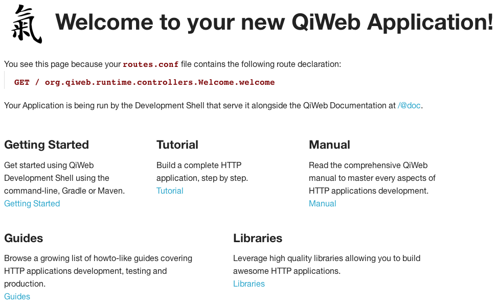

# QiWeb - Zen and Energy for Web Development

     _____ _ _ _ _     _      _____ ____  _____ 
    |     |_| | | |___| |_   |   __|    \|  |  |
    |  |  | | | | | -_| . |  |__   |  |  |    -|
    |__  _|_|_____|___|___|  |_____|____/|__|__|
       |__|

> This is a work in progress!

QiWeb is not published yet. If you read this, feel lucky :-)

**Table of contents**

- Getting Started
- Contribute to QiWeb

## Getting Started

The QiWeb documentation is not published online yet but it is embedded in the QiWeb Development Mode.
We'll bootstrap you there first.

### Installing the QiWeb command line

We are going to create a first application and run it in development mode in order to access the embedded documentation.

Of course, you need a [Java 8 SDK](http://www.oracle.com/technetwork/java/javase/downloads/) installed.

Then check your `JAVA_HOME` environment variable and ensure `java` and `javac` are available in `PATH`).

Now, here are the steps needed to install the `qiweb` command:

- Login to the [QiWeb Repository](https://repo.codeartisans.org/) (username: `qiweb`, password: `qiweb`)
- Download the [CLI distribution](https://repo.codeartisans.org/qiweb/org/qiweb/org.qiweb.cli/0.2.0.Alpha/org.qiweb.cli-0.2.0.Alpha-dist.zip)
- Unzip it
- Prepend the `bin` directory to your `PATH` (ex: `export PATH="/opt/qiweb/bin:${PATH}"`)
- Use the `qiweb` executable on UN*X
- Use the `qiweb.bat` executable on Windows

TIP: Invoke `qiweb --help` to get a comprehensive help on each commands and options.

### Create a new application

To create a new QiWeb application, use the `new` command of `qiweb`:

    user@host ~ $ qiweb new hello-qiweb
    New QiWeb Application generated in '/home/user/hello-qiweb'.
    user@host ~ $ cd hello-qiweb/
    user@host ~/hello-qiweb $

### Run the application in development mode

To run a QiWeb application in development mode, use the `run` command of `qiweb`:

    user@host ~/hello-qiweb $ qiweb run
     _____ _ _ _ _     _      ____          _____ _       _ _ 
    |     |_| | | |___| |_   |    \ ___ _ _|   __| |_ ___| | |
    |  |  | | | | | -_| . |  |  |  | -_| | |__   |   | -_| | |
    |__  _|_|_____|___|___|  |____/|___|\_/|_____|_|_|___|_|_|
       |__|

    Loading...
    Compiling Application...
    >> QiWeb DevShell starting...
    >> Ready for requests on http(s)://127.0.0.1:23023!

You can now open your browser to [http://localhost:23023/](http://localhost:23023/) to see the welcome page.

You should see the following page:

----

----

### Browse the embedded documentation

Simply open [http://localhost:23023/@doc](http://localhost:23023/@doc) to browse the embedded documentation, including javadocs.

If you encounter any problem, please [fill an issue](https://scm.codeartisans.org/qiweb/qiweb/issues/new) with the maximum information about your problem.

### Going further

You'll certainly want a build system to help you manage your application construction, its dependencies, packaging and so on.
The generated application contains sample build files for two build systems: Gradle and Maven.

To use Gradle, rename `build.gradle.example` as `build.gradle`.

To use Maven, rename `pom.xml.example` as `pom.xml`.

Both builds produce executables applications and allow you to run your application in production or development mode.
Respectively `gradle start` or `gradle devshell` and `mvn qiweb:start` or `mvn qiweb:devshell`.

### Get help

To discuss with the QiWeb community, post questions and get answers, it is easiest to do so at the project's [wall](https://scm.codeartisans.org/qiweb/qiweb/wall).

If you found a bug or want to request a new feature, use the [issue tracker](https://scm.codeartisans.org/qiweb/qiweb/issues) and read about [contributing to QiWeb](#contrib).

## Contribute to QiWeb

If you can read this, it means you already have full modification access to QiWeb's code and documentation.

We generally uses a Commit-Then-Review policy on most changes.
This allows a reasonable high velocity of development.

### Playing field

#### Found a bug?

If you encounter an issue, please report it by creating a [new issue](https://scm.codeartisans.org/qiweb/qiweb/issues/new) with as much detail as you can get.

Before doing so, please search for existing issues and make sure your bug hasn't been reported yet.

Remember that you can paste programs output, error traces etc.. into the issue and attach log files, screenshots to it.
Anything that could allow us to reproduce the bug in order to fix it is welcome!

If you happen to have some coding skills but don't want to dive into QiWeb source code, a test-case that reproduce the bug would be awesome.

#### Have a new feature or enhancement in mind?

Feature or enhancement requests are more than welcome.
They are as important as bugs as they give the opportunity to discuss what's in, what's missing etc...

Simply report them by creating a [new issue](https://scm.codeartisans.org/qiweb/qiweb/issues/new) describing the feature or enhancement you have in mind.

#### Want better documentation?

If you want to contribute to the documentation effort, well that's really good news!

The QiWeb documentation lies alongside the source code.
It is written using the `AsciiDoc` format and processed using `AsciiDoctor`, here is the [Writers Guide](http://asciidoctor.org/docs/asciidoc-writers-guide/).
All you need is a text editor.

The QiWeb build system generates a HTML version of the documentation.
You should start by building QiWeb from the source, see above.

Once that the build pass on your computer, see the [org.qiweb/org.qiweb.doc/src/asciidoc](org.qiweb/org.qiweb.doc/src/asciidoc) directory of the source repository, it contains the whole QiWeb documentation.
That is ;

- Getting Started (`getting-started.adoc` and the `getting-started` directory)
- The QiWeb Manual (`manual.adoc` and the `manual` directory)
- The QiWeb F.A.Q (`faq.adoc`)
- The Guides (`guides.adoc` and the `guides` directory)
- Modules documentation (`modules.adoc` and the `modules` directory)

Pick one, make some changes!

If you want to rebuild the documentation only after you made changes, go into the `org.qiweb/org.qiweb.doc` directory and issue `gradle asciidoctor`.

#### Want to contribute somehing new?

QiWeb is written using the Java language (but not limited to it, see the F.A.Q).
The source code is managed using `git`.
You'll need to use theses two technologies for contributing new code to QiWeb.

Of course, the first step is to build QiWeb from the source, see above.

Once you're confident the build is working on your computer, you'll want a convy IDE supporting Java 8.
QiWeb is built using Gradle that is supportted by many IDEs, see the [Gradle Tooling](http://www.gradle.org/tooling) page at `gradle.org`.

We recommand [Netbeans](https://netbeans.org/) but [IntelliJ IDEA](https://netbeans.org/) or [Eclipse](https://eclipse.org) will do.
If you are adventurous, any text editor can be used.

While you setup your workstation, continue reading to learn about the development workflow.

### Git branching model

Courtesy of Vincent Driessen, we borrowed the [git-flow](http://nvie.com/posts/a-successful-git-branching-model/) branching model.

----

----

It looks more complicated than it is. Here are the guidelines;

- Never commit to the 'master' branch while developing!!
- The 'develop' branch is the equivalent of trunk in subversion.
- Any changes that are not trivial, start a feature branch.
- The following names are reserved for not feature branches; `master`, `develop`, `hotfix/*`, `release/*`

Day-to-day development revolves around the develop branch and it is this branch that you typically clone from our repository if you intend to contribute to QiWeb itself.
If you create a new feature, or make some larger piece of refactoring, then please create a 'feature branch' (see article for details).

The release/* and hotfix/* branches are for release management only, and doesn't affect most contributors from a commit perspective.

For convenience you should install and use the [git-flow git extension](https://github.com/nvie/gitflow) that implement this branching model by adding git commands.
You may find the [git-flow cheatsheet](http://danielkummer.github.io/git-flow-cheatsheet/) helpful too. It is available in several languages.

#### Using Gitlab Merge Requests

Merge requests let you tell others about changes you've pushed to a Gitlab repository.
Once a pull request is sent, interested parties can review the set of changes, discuss potential modifications, and even push follow-up commits if necessary.

See the [Gitlab Help](https://scm.codeartisans.org/help/workflow) about this.
