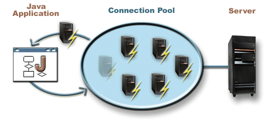

= JDBC Module
Database connectivity for your Application
:jbake-type: module

The JDBC module provide a `JDBCPlugin` that brings easy database connectivity and solid connection pooling thanks to
http://brettwooldridge.github.io/HikariCP/[HikariCP].

[quote,Wikipedia,https://en.wikipedia.org/wiki/Connection_pool]
____
In software engineering, a connection pool is a cache of database connections maintained so that the connections can be
reused when future requests to the database are required.
Connection pools are used to enhance the performance of executing commands on a database.
Opening and maintaining a database connection for each user, especially requests made to a dynamic database-driven
website application, is costly and wastes resources.
In connection pooling, after a connection is created, it is placed in the pool and it is used over again so that a new
connection does not have to be established.
____

[TIP]
.JDBC Documentation
====
This documentation do not cover `JDBC`, the Java API to work with databases, as it is already well covered on the
interwebs.
If you need guidance in that matter, we recommend you to head over at the official JDBC
http://docs.oracle.com/javase/tutorial/jdbc/overview/index.html[overview] and
http://docs.oracle.com/javase/tutorial/jdbc/basics/index.html[tutorial].
====

== Declaration

In order to use the `JDBCPlugin` you must add a dependency to `io.werval.modules.jdbc` and register the plugin in your
configuration.

When using Gradle:

.build.gradle
[source,groovy,subs="attributes,specialcharacters"]
----
compile 'io.werval:io.werval.modules.jdbc:{werval-version}'
----

When using Maven:

.pom.xml
[source,xml,subs="attributes,specialcharacters"]
----
<dependency>
    <groupId>io.werval</groupId>
    <artifactId>io.werval.modules.jdbc</artifactId>
    <version>{werval-version}</version>
</dependency>
----

And finally your application configuration:

.application.conf
[source,json]
----
app.plugins.enabled += jdbc
----

== Configuration

Multiple `DataSources` can be configured in your `application.conf`.
One of them is the default one.
This is the one named `default`.

So, to use a single `DataSource` you simply configure the `default` one:

.application.conf
[source,json]
----
jdbc {
    datasource.default {
        driver = "fully.qualified.classname.of.your.database.Driver"
        url = "your-db-jdbc-url"
        username = "your-db-username"
        password = "your-db-password"
    }
}
----

The default `DataSource` name can be changed by setting the `jdbc.default_datasource` configuration property.

Here is a configuration snippet that sets up two `DataSources` (`first_ds` & `second_ds`) and change the default one's
name:

.application.conf
[source,json]
----
jdbc {
    default_datasource = first_ds
    datasources.first_ds {
        driver = "fully.qualified.classname.of.your.database.Driver"
        url = "first-db-jdbc-url"
        username = "first-db-username"
        password = "first-db-password"
    }
    datasources.second_ds {
        driver = "fully.qualified.classname.of.your.database.Driver"
        url = "second-db-jdbc-url"
        username = "second-db-username"
        password = "second-db-password"
    }
}
----

=== Connection Pooling

The Hikari connection pool can be tuned for each configured DataSource directly from your application configuration.

Here is the list of supported configuration properties and their type:

.application.conf
[source,json]
----
jdbc {
    datasources.first_ds {
        # ...
        autocommit = yes/no
        isolation = string (one of TRANSACTION_NONE, TRANSACTION_READ_COMMITTED, TRANSACTION_READ_UNCOMMITTED, TRANSACTION_REPEATABLE_READ or TRANSACTION_SERIALIZABLE)
        readOnly = yes/no
        catalog = string
        minimumIdle = integer
        maximumPoolSize = integer
        connectionTimeout = duration (eg '2 minutes')
        idleTimeout = duration
        maxLifetime = duration
        initializationFailFast = yes/no
        leakDetectionThreshold = duration
        connectionInitSql = string
        connectionTestQuery = string
        registerMbeans = yes/no
        isolateInternalQueries = yes/no
    }
}
----

See the HikariCP http://brettwooldridge.github.io/HikariCP/[documentation] for the details of each one of theses
properties and their default values.

=== JNDI

If you need to expose your DataSource in JNDI, simply add the desired `jndiName` to its configuration:

.application.conf
[source,json]
----
jdbc {
    datasources.first_ds {
        # ...
        jndiName = MyDataSource
    }
}
----

It will automatically use the JNDI module running an embedded JNDI service and register the DataSource with the
configured name.

[TIP]
.JPA & JNDI
====
This is needed for JPA, see the JPA module documentation.
====

=== Logging

The Hikari connection pool will log to SLF4J.

If you need precise JDBC & SQL logging, you can enable the https://code.google.com/p/log4jdbc-log4j2/[log4jdbc]
integration per DataSource in your configuration:

.application.conf
[source,json]
----
jdbc {
    datasources.second_ds {
        # ...
        log4jdbc = yes
    }
}
----

`log4jdbc` will log using SLF4J to the `jdbc.sqlonly`, `jdbc.sqltiming`, `jdbc.audit`, `jdbc.resultset`,
`jdbc.resultsettable` and `jdbc.connection` loggers.

[TIP]
.log4jdbc configuration
====
This documentation do not cover `log4jdbc` as it is already well covered on official
https://code.google.com/p/log4jdbc-log4j2/[website].

For convenience the `jdbc.log4jdbc` configuration object is loaded as System Properties.
This allow you to configure `log4jdbc` from your application config file.
For example:

.application.conf
[source,json]
----
jdbc {
    log4jdbc {
        # Log only for com.acme.*
        "debug.stack.prefix" = "^com\.acme.*"
    }
}
----
====

=== Metrics

To get JDBC Metrics reported, simply enable it in your configuration:

.application.conf
[source,json]
----
jdbc.metrics = yes
----

See the Metrics module documentation for more metrics insights.

== Usage

Here is how to get a `Connection` to the default `DataSource`:

.SomeController.java
[source,java]
----
include::src/test/java/io/werval/modules/jdbc/DocumentationSupport.java[lines=18..21,indent=0]

include::src/test/java/io/werval/modules/jdbc/DocumentationSupport.java[lines=25..37,indent=0]
----

To use a specific `DataSource`, use the other methods available in the `JDBC` class, here is a sample using the
`second_ds` `DataSource`:

[source,java]
----
include::src/test/java/io/werval/modules/jdbc/DocumentationSupport.java[lines=42..45,indent=0]
----
