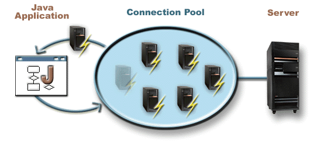

= JDBC Module
Database connectivity for your Application
:jbake-type: module

The JDBC module provide a `JDBCPlugin` that brings easy database connectivity and solid connection pooling thanks to
http://brettwooldridge.github.io/HikariCP/[HikariCP].

[quote,Wikipedia,https://en.wikipedia.org/wiki/Connection_pool]
____
In software engineering, a connection pool is a cache of database connections maintained so that the connections can be
reused when future requests to the database are required.
Connection pools are used to enhance the performance of executing commands on a database.
Opening and maintaining a database connection for each user, especially requests made to a dynamic database-driven
website application, is costly and wastes resources.
In connection pooling, after a connection is created, it is placed in the pool and it is used over again so that a new
connection does not have to be established.
____

[TIP]
.JDBC Documentation
====
This documentation do not cover `JDBC`, the Java API to work with databases, as it is already well covered on the
interwebs.
If you need guidance in that matter, we recommend you to head over at the official JDBC
http://docs.oracle.com/javase/tutorial/jdbc/overview/index.html[overview] and
http://docs.oracle.com/javase/tutorial/jdbc/basics/index.html[tutorial].
====

== Declaration

In order to use the `JDBCPlugin` you must add a dependency to `org.qiweb.modules.jdbc` and register the plugin in your
configuration.

When using Gradle:

.build.gradle
[source,groovy,subs="attributes,specialcharacters"]
----
compile 'org.qiweb:org.qiweb.modules.jdbc:{qiweb-version}'
----

When using Maven:

.pom.xml
[source,xml,subs="attributes,specialcharacters"]
----
<dependency>
    <groupId>org.qiweb</groupId>
    <artifactId>org.qiweb.modules.jdbc</artifactId>
    <version>{qiweb-version}</version>
</dependency>
----

And finally your application configuration:

.application.conf
[source,json]
----
app.plugins.enabled += jdbc
----

== Configuration

Multiple `DataSources` can be configured in your `application.conf`.
One of them is the default one.
This is the one named `default`.

So, to use a single `DataSource` you simply configure the `default` one:

.application.conf
[source,json]
----
jdbc {
    datasource.default {
        driver = "fully.qualified.classname.of.your.database.Driver"
        url = "your-db-jdbc-url"
        username = "your-db-username"
        password = "your-db-password"
    }
}
----

The default `DataSource` name can be changed by setting the `jdbc.default_datasource` configuration property.

Here is a configuration snippet that sets up two `DataSources` (`first_ds` & `second_ds`) and change the default one's
name:

.application.conf
[source,json]
----
jdbc {
    default_datasource = first_ds
    datasources.first_ds {
        driver = "fully.qualified.classname.of.your.database.Driver"
        url = "first-db-jdbc-url"
        username = "first-db-username"
        password = "first-db-password"
    }
    datasources.second_ds {
        driver = "fully.qualified.classname.of.your.database.Driver"
        url = "second-db-jdbc-url"
        username = "second-db-username"
        password = "second-db-password"
    }
}
----

== Usage

Here is how to get a `Connection` to the default `DataSource`:

.SomeController.java
[source,java]
----
include::src/test/java/org/qiweb/modules/jdbc/DocumentationSupport.java[lines=18..21,indent=0]

include::src/test/java/org/qiweb/modules/jdbc/DocumentationSupport.java[lines=25..37,indent=0]
----

To use a specific `DataSource`, use the other methods available in the `JDBC` class, here is a sample using the
`second_ds` `DataSource`:

[source,java]
----
include::src/test/java/org/qiweb/modules/jdbc/DocumentationSupport.java[lines=42..45,indent=0]
----
